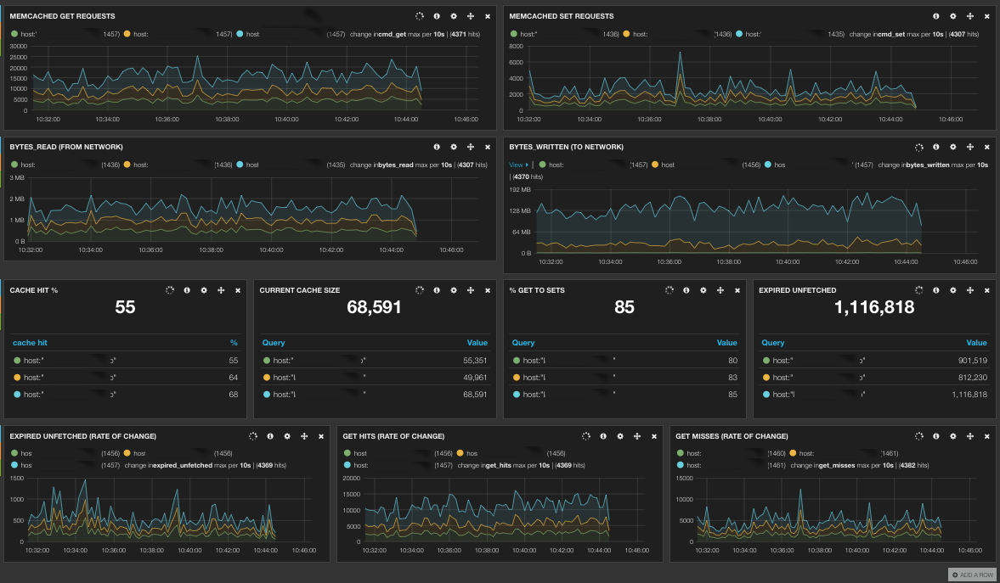

- [Memcached Stats For Logstash](#memcached-stats-for-logstash)
    - [Configuration](#configuration)
	    - [Extracting all stats as searchable fields](#extracting-all-stats-as-searchable-fields)
	    - [Polling Frequency](#polling-frequency)
	    - [Specifying the memcached host](#specifying-the-memcached-host)
	    - [Specifying the key/value separator](#specifying-the-key-and-value-separator)
	    - [Specifying the delimeter between the different stats](#specifying-the-delimeter-between-the-different-stats)
	    - [Retry on Connection Failure](#retry-on-connection-failure)
    - [Installation](#installation)
    - [Example kibana tracking](#example-kibana-tracking)
    - [License](#license)        	    
	    

# Memcached Stats

An Input for obtaining memcached_stats for logstash.
The input connects to a memcached host and issues the "stats" command periodically
The stats are turned either into key/value event pairs, or just assembled into key value pairs
in a message event:

stats as event keys:

    {
                      "message" => "|accepting_conns=1|auth_cmds=0|auth_errors=0|bytes=0|bytes_read=828|bytes_written=141125|cas_badval=0|cas_hits=0|cas_misses=0|cmd_flush=0|cmd_get=0|cmd_set=0|cmd_touch=0|conn_yields=0|connection_structures=11|curr_connections=10|curr_items=0|decr_hits=0|decr_misses=0|delete_hits=0|delete_misses=0|evicted_unfetched=0|evictions=0|expired_unfetched=0|get_hits=0|get_misses=0|gets_to_sets_percent=0|hash_bytes=524288|hash_is_expanding=0|hash_power_level=16|hit_percent=0|incr_hits=0|incr_misses=0|libevent=2.0.17-stable|limit_maxbytes=67108864|listen_disabled_num=0|pid=32933|pointer_size=64|reclaimed=0|reserved_fds=20|rusage_system=0.017002|rusage_user=0.016938|threads=4|time=1403978797|total_connections=14|total_items=0|touch_hits=0|touch_misses=0|uptime=390|version=1.4.13|",
                     "@version" => "1",
                   "@timestamp" => "2014-06-28T18:06:38.026Z",
              "accepting_conns" => 1,
                    "auth_cmds" => 0,
                  "auth_errors" => 0,
                        "bytes" => 0,
                   "bytes_read" => 828,
                "bytes_written" => 141125,
                   "cas_badval" => 0,
                     "cas_hits" => 0,
                   "cas_misses" => 0,
                    "cmd_flush" => 0,
                      "cmd_get" => 0,
                      "cmd_set" => 0,
                    "cmd_touch" => 0,
                  "conn_yields" => 0,
        "connection_structures" => 11,
             "curr_connections" => 10,
                   "curr_items" => 0,
                    "decr_hits" => 0,
                  "decr_misses" => 0,
                  "delete_hits" => 0,
                "delete_misses" => 0,
            "evicted_unfetched" => 0,
                    "evictions" => 0,
            "expired_unfetched" => 0,
                     "get_hits" => 0,
                   "get_misses" => 0,
         "gets_to_sets_percent" => 0,
                   "hash_bytes" => 524288,
            "hash_is_expanding" => 0,
             "hash_power_level" => 16,
                  "hit_percent" => 0,
                    "incr_hits" => 0,
                  "incr_misses" => 0,
               "limit_maxbytes" => 67108864,
          "listen_disabled_num" => 0,
                          "pid" => 32933,
                 "pointer_size" => 64,
                    "reclaimed" => 0,
                 "reserved_fds" => 20,
                "rusage_system" => 0,
                  "rusage_user" => 0,
                      "threads" => 4,
            "total_connections" => 14,
                  "total_items" => 0,
                   "touch_hits" => 0,
                 "touch_misses" => 0,
                       "uptime" => 390,
                         "host" => "Dominics-MacBook-Pro.local",
                "memcachedhost" => "localhost",
                "memcachedport" => 11211,
                         "type" => "memcached_stats"
    }

stats as a key/value pairs in the message event:

    {
              "message" => "|accepting_conns=1|auth_cmds=0|auth_errors=0|bytes=0|bytes_read=888|bytes_written=151454|cas_badval=0|cas_hits=0|cas_misses=0|cmd_flush=0|cmd_get=0|cmd_set=0|cmd_touch=0|conn_yields=0|connection_structures=11|curr_connections=10|curr_items=0|decr_hits=0|decr_misses=0|delete_hits=0|delete_misses=0|evicted_unfetched=0|evictions=0|expired_unfetched=0|get_hits=0|get_misses=0|gets_to_sets_percent=0|hash_bytes=524288|hash_is_expanding=0|hash_power_level=16|hit_percent=0|incr_hits=0|incr_misses=0|libevent=2.0.17-stable|limit_maxbytes=67108864|listen_disabled_num=0|pid=32933|pointer_size=64|reclaimed=0|reserved_fds=20|rusage_system=0.027329|rusage_user=0.024066|threads=4|time=1403979593|total_connections=15|total_items=0|touch_hits=0|touch_misses=0|uptime=1186|version=1.4.13|",
             "@version" => "1",
           "@timestamp" => "2014-06-28T18:19:54.342Z",
                 "host" => "Dominics-MacBook-Pro.local",
        "memcachedhost" => "localhost",
        "memcachedport" => 11211,
                 "type" => "memcached_stats"
    }

## Configuration

The logstash configuration for the memcached stats is as follows:

    input {
      memcached_stats { 
        type => "memcached_stats"         
      }
    }

The above configuration connects to a memcached on the localhost on port 11211.  The events that will be output will be 
similar to the following

    {
              "message" => "|accepting_conns=1|auth_cmds=0|auth_errors=0|bytes=0|bytes_read=888|bytes_written=151454|cas_badval=0|cas_hits=0|cas_misses=0|cmd_flush=0|cmd_get=0|cmd_set=0|cmd_touch=0|conn_yields=0|connection_structures=11|curr_connections=10|curr_items=0|decr_hits=0|decr_misses=0|delete_hits=0|delete_misses=0|evicted_unfetched=0|evictions=0|expired_unfetched=0|get_hits=0|get_misses=0|gets_to_sets_percent=0|hash_bytes=524288|hash_is_expanding=0|hash_power_level=16|hit_percent=0|incr_hits=0|incr_misses=0|libevent=2.0.17-stable|limit_maxbytes=67108864|listen_disabled_num=0|pid=32933|pointer_size=64|reclaimed=0|reserved_fds=20|rusage_system=0.027329|rusage_user=0.024066|threads=4|time=1403979593|total_connections=15|total_items=0|touch_hits=0|touch_misses=0|uptime=1186|version=1.4.13|",
             "@version" => "1",
           "@timestamp" => "2014-06-28T18:19:54.342Z",
                 "host" => "Dominics-MacBook-Pro.local",
        "memcachedhost" => "localhost",
        "memcachedport" => 11211,
                 "type" => "memcached_stats"
    }
    
Note the memcached stats are contained within the "message" event (field).  This means you will need to use a custom
filter to extract the values you wish to be indexed and searchable (and graphable in kibana).  For example, the following
extracts `bytes_read`, `curr_items`, `get_hits` and `get_misses`:

    input { 
        memcached_stats { 
            type => "memcached_stats" 
        } 
    } 
    filter { 
        grok {  
            match => [ "message", ".*bytes_read=%{NUMBER:bytes_read:int}\|.*curr_items=%{NUMBER:curr_items:int}\|.*get_hits=%{NUMBER:get_hits:int}\|.*get_misses=%{NUMBER:get_misses:int}" ]
        } 
    } 
    output { 
        elasticsearch_http { 
            host => "localhost" 
        }  
    }
    

When stored in elasticsearch the document will look as follows:

    {
        _index: logstash-2014.06.28
        _type: memcached_stats
        _id: DGu073JrTz2IDbERVByNJQ
        _version: 1
        _score: 1
        _source: {
            message: |accepting_conns=1|auth_cmds=0|auth_errors=0|bytes=0|bytes_read=936|bytes_written=159718|cas_badval=0|cas_hits=0|cas_misses=0|cmd_flush=0|cmd_get=0|cmd_set=0|cmd_touch=0|conn_yields=0|connection_structures=11|curr_connections=10|curr_items=0|decr_hits=0|decr_misses=0|delete_hits=0|delete_misses=0|evicted_unfetched=0|evictions=0|expired_unfetched=0|get_hits=0|get_misses=0|gets_to_sets_percent=0|hash_bytes=524288|hash_is_expanding=0|hash_power_level=16|hit_percent=0|incr_hits=0|incr_misses=0|libevent=2.0.17-stable|limit_maxbytes=67108864|listen_disabled_num=0|pid=32933|pointer_size=64|reclaimed=0|reserved_fds=20|rusage_system=0.064786|rusage_user=0.042446|threads=4|time=1403986254|total_connections=16|total_items=0|touch_hits=0|touch_misses=0|uptime=7847|version=1.4.13|
            @version: 1
            @timestamp: 2014-06-28T20:10:54.444Z
            host: Dominics-MacBook-Pro.local
            memcachedhost: localhost
            memcachedport: 11211
            type: memcached_stats
            bytes_read: 936
            curr_items: 0
            get_hits: 0
            get_misses: 0
        }
    }
    
    
### Extracting all stats as searchable fields ###
    
Rather than having to configure a filter, you can have the input extract memcached start as searchable fields for you,
by setting `true` for the `store_all_keys` option:
    
    input { 
        memcached_stats { 
            type           => "memcached_stats"
            store_all_keys => true
        } 
    }
    output { 
        elasticsearch_http { 
            host => "localhost" 
        }  
    } 
    
This will extract all elements.  If you don't want some of the fields use the `ignore_keys` configuration option:

    input { 
        memcached_stats { 
            type           => "memcached_stats"
            store_all_keys => true
            ignore_keys    => ['libevent','version','time']
        } 
    }
    
    
### Polling Frequency ###
    
By default the input will poll memcached every second.  To reduce or increase this frequency you can use the `poll_period_s`
configuration option.  The following will poll every 0.5 seconds (500 millis):

    input { 
        memcached_stats { 
            type           => "memcached_stats"
            store_all_keys => true
            ignore_keys    => ['libevent','version','time']
            poll_period_s  => 0.5
        } 
    }    
    
### Specifying the memcached host ###
    
By default the input will connect to the localhost on port 11211.  To change this use the configuration options
`host` and `port`    
    
    input { 
        memcached_stats { 
            type           => "memcached_stats"
            store_all_keys => true
            ignore_keys    => ['libevent','version','time']
            poll_period_s  => 0.5
            host           => "10.0.1.9" 
            port           => "11211"
        } 
    }
    
### Specifying the key and value separator ###

By default the separator in the message for the statistic name and value is `=`.  To specify a different separator you
can use the configuration option `value_separator`:

    input { 
        memcached_stats { 
            type           => "memcached_stats"
            store_all_keys => true
            ignore_keys    => ['libevent','version','time']
            poll_period_s  => 0.5
            host           => "10.0.1.9" 
            port           => "11211"
            value_separator=> ":"
        } 
    }
    
    
### Specifying the delimeter between the different stats ###
    
By default the separator between the differing stats in the message field is '|'.  To specify a different separator you
can use the configuration option `stat_separator`.

    input { 
        memcached_stats { 
            type           => "memcached_stats"
            store_all_keys => true
            ignore_keys    => ['libevent','version','time']
            poll_period_s  => 0.5
            host           => "10.0.1.9" 
            port           => "11211"
            value_separator=> ":"
            stat_separator => ","
        } 
    }

### Retry on Connection Failure ###

The plugin will attempt to reconnect to memcached incase of a connection failure between the persistent connection from the
plugin and memcached.  By default the delay between connection retries is 5 seconds (i.e. it will attempt to reconnect to
memcached every 5seconds).  To change this you can use the configuration option `reconnect_period_s`:

    input { 
        memcached_stats { 
            type           => "memcached_stats"
            store_all_keys => true
            ignore_keys    => ['libevent','version','time']
            poll_period_s  => 0.5
            host           => "10.0.1.9" 
            port           => "11211"
            value_separator=> ":"
            stat_separator => ","
            reconnect_period_s => 10
        } 
    }

    
## Installation ##
    
The input ruby script (`'memcached_stats.rb`) should be installed in `logstash/inputs/`.  This is either in your plugins 
location, or within your logstash distribution in `lib/logstash/inputs/`.  For example:

    bin/logstash --pluginpath /Users/dominictootell/git/logstash_memcached_stats -e \
    'input { memcached_stats { type => "memcached_stats" stat_separator => "|"  
    ignore_keys => ['libevent','version','time'] store_all_keys => true poll_period_s => 0.5 host => "10.0.1.9" port => "11211"} } 
    output { stdout { codec => rubydebug } }'    

## Example kibana tracking ##

The following shows an example screenshot of a kibana dashboard the is tracking a 3 node memcached pool in production.

The dashboard is tracking several memcached stats: `bytes_read`, `bytes_written`, `cmd_get`, `cmd_set`, `get_hits`, `get_misses`, `curr_items`, `expired_unfetched`, and two stats calculated by the memcached_stats plugin `hit_percent`, `gets_to_sets_percent`.

With the dashboard we are to see, in real time, that one memcached instances is receiving considerably more traffic than the other nodes.  This is very indicative of a "hot keys" scenario (this is actually what it was - clarified by using memkeys on the host in question).  

 

## License ##

Apache v2, See LICENSE file